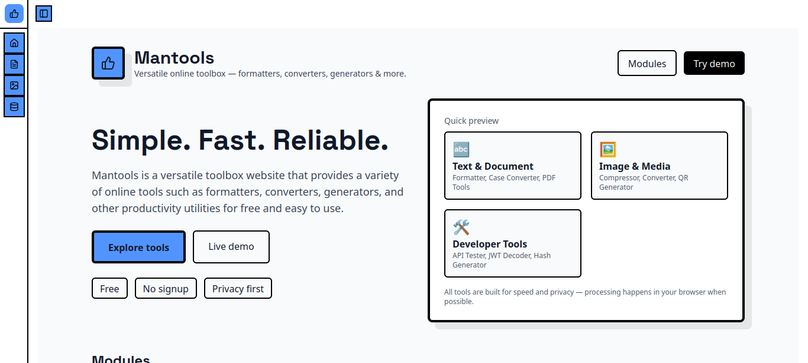
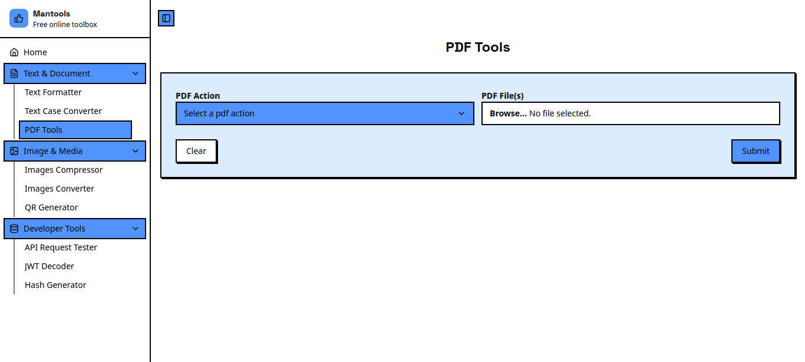
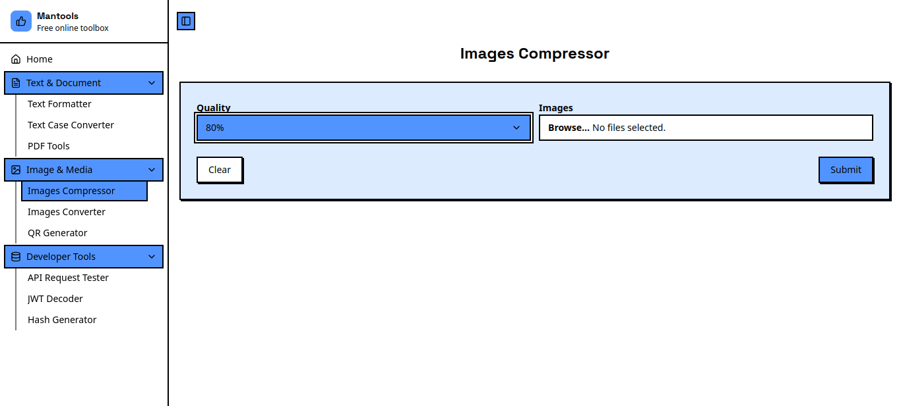
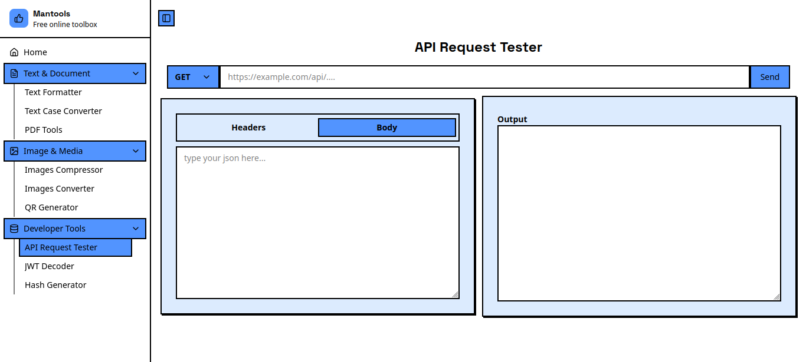

# Mantools

**Mantools** is a versatile toolbox website that provides a variety of online tools such as formatters, converters, generators, and other productivity utilities. All tools are **free**, **fast**, and **easy to use** through a clean web interface.

🌐 **Live Demo:** https://www.mantools.tech/

---

## ✨ Features
- Text formatter & case converter
- Image tools (compress & convert)
- QR code generator
- Hash & JWT tools
- PDF utilities
- API request tester
- Authentication & dashboard

---

## 🛠 Tech Stack
### Backend
- **Go 1.24**
- **Gin** (HTTP framework)
- **GORM** (PostgreSQL)
- JWT Authentication
- Image & PDF processing

### Frontend
- **Next.js 15 (TypeScript)**
- **React 19**
- **Tailwind CSS**
- **Radix UI**
- Recharts

### Infrastructure
- **Docker**
- **Nginx**

---

## 📦 Project Structure (Simplified)
```
mantools/
├── backend/      # Gin Go API
├── frontend/     # Next.js app
├── nginx/        # Nginx config
├── screenshots
├── docker-compose.yml
└── README.md
```

---

## 🚀 Run with Docker
```bash
docker compose up --build
```

---

## 🖼 Screenshots





---

## 📄 License
MIT License

---

Developed as a productivity-focused toolbox for everyday developer and general-use needs.

